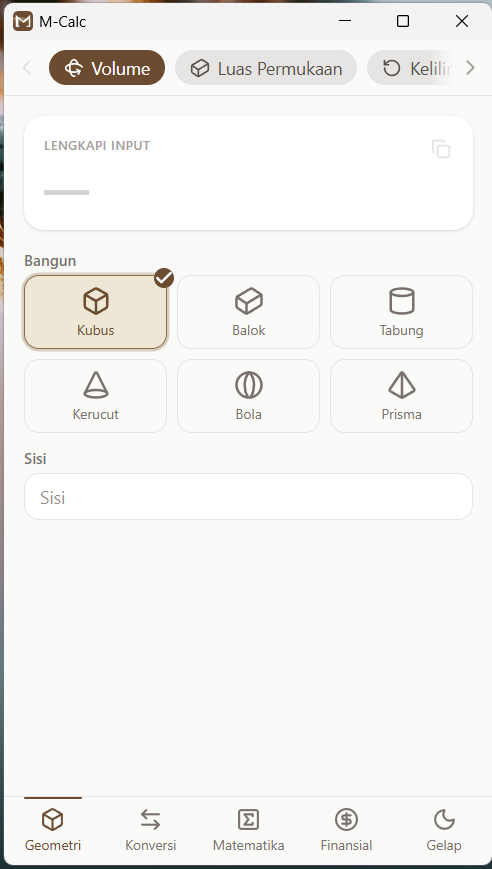
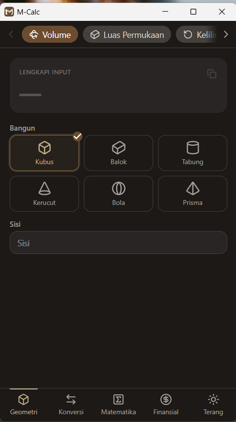

# M-Calc

Kalkulator serbaguna **ringan** untuk desktop Windows — 32 alat hitung dalam satu
jendela compact. Penulisan ulang `kalkulator-serbaguna` (single-file HTML) menjadi
aplikasi native dengan Tauri.

<p align="center">
  
  &nbsp;&nbsp;
  
</p>

## ✨ Fitur

- **32 alat** dalam 4 kategori (navigasi bottom-tabs + chip per alat)
- **Perhitungan live** — hasil langsung muncul saat mengetik, tanpa tombol
- **Salin hasil** ke clipboard sekali klik
- **Mode terang & gelap** dengan palet cokelat serasi logo
- **Sangat ringan** — installer hanya ~1,9 MB, RAM kecil (WebView2 bawaan Windows)

### Daftar alat

| Kategori | Alat |
|---|---|
| 📐 **Geometri** | Volume · Luas Permukaan · Keliling · Luas Datar · Pythagoras · Jarak 2 Titik · Diagonal · Juring & Busur · Gradien Garis |
| 🔄 **Konversi** | Berat · Jarak · Suhu · Mata Uang · Waktu · Kecepatan · Luas · Volume Cairan · Data Digital · Bilangan (basis) |
| % **Matematika** | Persentase · Pecahan · Skala · FPB & KPK · Persamaan Kuadrat · Statistik · Permutasi & Kombinasi |
| 💰 **Finansial** | Diskon · Cicilan · Untung/Rugi · Margin & Markup · Bunga · Zakat |

## ⬇️ Unduh

Ambil installer terbaru di **[Releases](https://github.com/s4rt4/mcalc/releases/latest)**:
unduh `m-calc_x.y.z_x64-setup.exe`, jalankan (per-user, tanpa admin), Windows x64.

## 🛠 Tech stack

- **Tauri 2** (Rust + WebView2) — binary kecil, hemat RAM
- **Svelte 5** (runes) + **Vite 6** + **TypeScript**
- **Tailwind CSS v4**

Bundle frontend: ~82 KB JS / ~14 KB CSS (≈30 KB gzip).

## 🧩 Arsitektur

Tiap alat didefinisikan secara *data-driven* di `src/lib/tools/`
(`geometri` · `konversi` · `matematika` · `finansial`) sebagai objek `Tool`
berisi field deklaratif + fungsi `compute` murni, lalu dirender oleh satu
komponen generik `ToolView.svelte`. Menambah alat = menambah satu objek.

```
src/
├─ App.svelte              # shell: chip row + konten + bottom bar
├─ lib/
│  ├─ ToolView.svelte      # renderer generik (display + input)
│  ├─ Field.svelte         # input / dropdown / shape-picker
│  ├─ types.ts, format.ts
│  └─ tools/               # definisi 32 alat
svg/                       # logo + ikon (lucide, currentColor)
src-tauri/                 # backend Rust + konfigurasi + installer
```

## 💻 Pengembangan

```bash
pnpm install
pnpm tauri dev      # dev (port 1430 — sengaja beda agar tak bentrok project Tauri lain)
pnpm tauri build --bundles nsis   # installer Windows (.exe)
```

## 🎨 Kustomisasi tema

Palet aksen dipusatkan di blok `@theme` pada `src/app.css` — ubah 4 baris hex
`--color-brand-*` untuk mengganti seluruh aksen aplikasi.

## 📝 Catatan

- Kurs mata uang masih **statik** (USD/IDR/EUR/JPY).
- Ikon & logo: SVG di `svg/` (format lucide `currentColor`); app icon di-generate
  dari `svg/logo.svg` via `pnpm tauri icon`.

## Lisensi

MIT © Sarta
